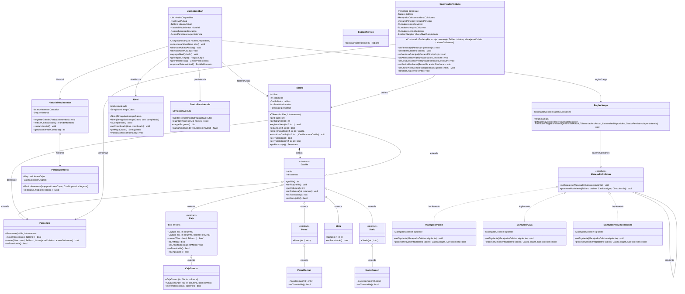

# Diagrama de Clases - Carpeta `model`

Este documento contiene el diagrama de clases Mermaid actualizado que representa la estructura física de la carpeta `model` del proyecto Sokoban.

```mermaid
classDiagram
    class JuegoSokoban {
        -List nivelesDisponibles
        -Nivel nivelActual
        -Tablero tableroActual
        -HistorialMovimientos historial
        -ReglasJuego reglasJuego
        -GestorPersistencia persistencia
        +JuegoSokoban(List nivelesDisponibles)
        +seleccionarNivel(Nivel nivel) void
        +deshacerUltimaAccion() void
        +reiniciarNivelActual() void
        +agregarNivel(Nivel n) void
        +getReglasJuego() ReglasJuego
        +getPersistencia() GestorPersistencia
        +capturarEstadoActual() PartidaMomento
    }

    class Tablero {
        -int filas
        -int columnas
        -CasillaMatrix celdas
        -booleanMatrix metas
        -Personaje personaje
        +Tablero(int filas, int columnas)
        +getFilas() int
        +getColumnas() int
        +registrarMeta(int f, int c) void
        +esMeta(int f, int c) bool
        +obtenerCasilla(int f, int c) Casilla
        +actualizarCasilla(int f, int c, Casilla nuevaCasilla) void
        +esTransitable() bool
        +esTransitable(int f, int c) bool
        +getPersonaje() Personaje
    }

    class Casilla {
        <<abstract>>
        -int fila
        -int columna
        +getFila() int
        +setFila(int fila) void
        +getColumna() int
        +setColumna(int columna) void
        +esTransitable()* bool
        +esEmpujable() bool
    }

    class Personaje {
        +Personaje(int fila, int columna)
        +mover(Direccion d, Tablero t) bool
        +mover(Direccion d, Tablero t, ManejadorColision cadenaColisiones) bool
        +esTransitable() bool
    }

    class Caja {
        <<abstract>>
        -bool enMeta
        +Caja(int fila, int columna)
        +Caja(int fila, int columna, boolean enMeta)
        +mover(Direccion d, Tablero t)* bool
        +isEnMeta() bool
        +setEnMeta(boolean enMeta) void
        +esTransitable() bool
        +esEmpujable() bool
    }

    class CajaComun {
        +CajaComun(int fila, int columna)
        +CajaComun(int fila, int columna, bool enMeta)
        +mover(Direccion d, Tablero t) bool
    }

    class Pared {
        <<abstract>>
        +Pared(int f, int c)
    }

    class ParedComun {
        +ParedComun(int f, int c)
        +esTransitable() bool
    }

    class Meta {
        +Meta(int f, int c)
        +esTransitable() bool
    }

    class Suelo {
        <<abstract>>
        +Suelo(int f, int c)
    }

    class SueloComun {
        +SueloComun(int f, int c)
        +esTransitable() bool
    }

    class FabricaNiveles {
        +construirTablero(Nivel n) Tablero
    }

    class HistorialMovimientos {
        -int movimientosContador
        -Deque historial
        +registrarEstado(PartidaMomento e) void
        +extraerUltimoEstado() PartidaMomento
        +vaciarHistorial() void
        +getMovimientosContador() int
    }

    class Nivel {
        -bool completado
        -StringMatrix mapaDatos
        +Nivel(StringMatrix mapaDatos)
        +Nivel(StringMatrix mapaDatos, bool completado)
        +isCompletado() bool
        +setCompletado(bool completado) void
        +getMapaDatos() StringMatrix
        +marcarComoCompletado() void
    }

    class PartidaMomento {
        -Map posicionesCajas
        -Casilla posicionJugador
        +PartidaMomento(Map posicionesCajas, Casilla posicionJugador)
        +restaurarEnTablero(Tablero t) void
    }

    class GestorPersistencia {
        -String archivoRuta
        +GestorPersistencia(String archivoRuta)
        +guardarProgreso(List niveles) void
        +cargarProgreso() List
        +cargarNivelDesdeRecursos(int nivelId) Nivel
    }

    class ManejadorColision {
        <<interface>>
        +setSiguiente(ManejadorColision siguiente) void
        +procesarMovimiento(Tablero tablero, Casilla origen, Direccion dir) bool
    }

    class ManejadorPared {
        -ManejadorColision siguiente
        +setSiguiente(ManejadorColision siguiente) void
        +procesarMovimiento(Tablero tablero, Casilla origen, Direccion dir) bool
    }

    class ManejadorCaja {
        -ManejadorColision siguiente
        +setSiguiente(ManejadorColision siguiente) void
        +procesarMovimiento(Tablero tablero, Casilla origen, Direccion dir) bool
    }

    class ManejadorMovimientoBase {
        -ManejadorColision siguiente
        +setSiguiente(ManejadorColision siguiente) void
        +procesarMovimiento(Tablero tablero, Casilla origen, Direccion dir) bool
    }

    class ReglasJuego {
        -ManejadorColision cadenaColisiones
        +ReglasJuego()
        +getCadenaColisiones() ManejadorColision
        +verificarYRegistrarVictoria(Nivel nivelActual, Tablero tableroActual, List nivelesDisponibles, GestorPersistencia persistencia) void
    }

    class ControladorTeclado {
        -Personaje personaje
        -Tablero tablero
        -ManejadorColision cadenaColisiones
        -VentanaPrincipal ventanaPrincipal
        -Runnable antesDeMover
        -Runnable despuesDeMover
        -Runnable accionDeshacer
        -BooleanSupplier checkNivelCompletado
        +ControladorTeclado(Personaje personaje, Tablero tablero, ManejadorColision cadenaColisiones)
        +setPersonaje(Personaje personaje) void
        +setTablero(Tablero tablero) void
        +setVentanaPrincipal(VentanaPrincipal vp) void
        +setAntesDeMover(Runnable antesDeMover) void
        +setDespuesDeMover(Runnable despuesDeMover) void
        +setAccionDeshacer(Runnable accionDeshacer) void
        +setCheckNivelCompletado(BooleanSupplier check) void
        +handle(KeyEvent evento) void
    }

    ManejadorColision <|.. ManejadorPared : implements
    ManejadorColision <|.. ManejadorCaja : implements
    ManejadorColision <|.. ManejadorMovimientoBase : implements
    ManejadorColision --> ManejadorColision : siguiente

    Casilla <|-- Personaje : extends
    Casilla <|-- Caja : extends
    Casilla <|-- Pared : extends
    Casilla <|-- Meta : extends
    Casilla <|-- Suelo : extends
    Casilla <|-- Tablero : extends
    Suelo <|-- SueloComun : extends
    Caja <|-- CajaComun : extends
    Pared <|-- ParedComun : extends

    Tablero *--> Casilla : celdas
    Tablero --> Personaje : personaje
    JuegoSokoban --> Tablero : tableroActual
    JuegoSokoban --> ReglasJuego : reglasJuego
    JuegoSokoban --> HistorialMovimientos : historial
    JuegoSokoban --> GestorPersistencia : persistencia
    JuegoSokoban --> Nivel : nivelActual
    ReglasJuego --> ManejadorColision : cadenaColisiones
    HistorialMovimientos o--> PartidaMomento : historial
    ControladorTeclado --> Personaje : personaje
    ControladorTeclado --> Tablero : tablero
```
